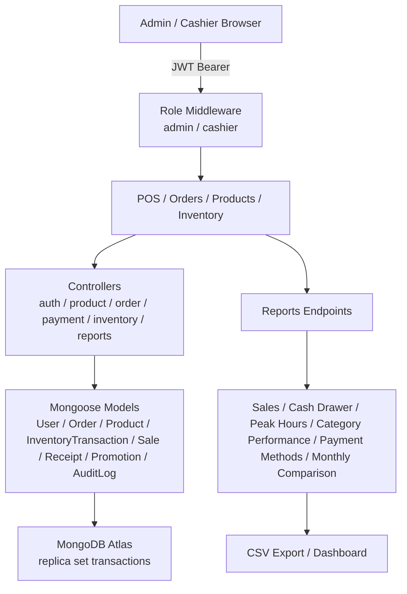
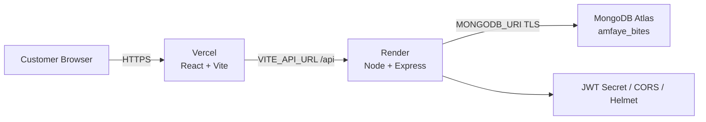
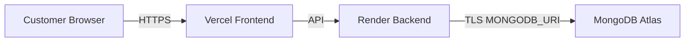
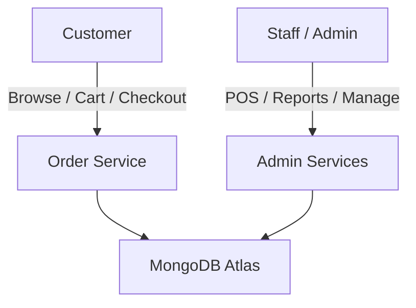
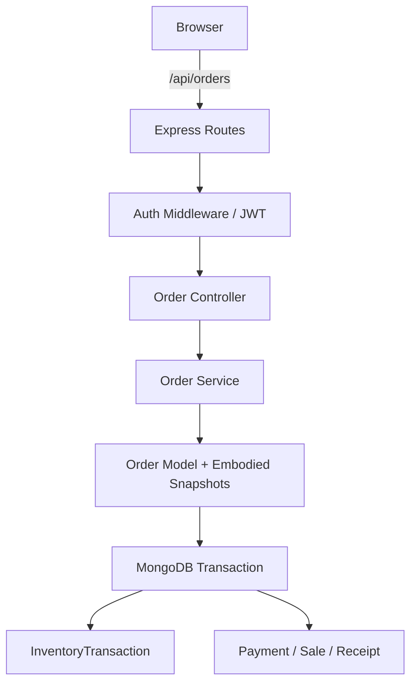

# Amfaye Bites — Data Flow Diagrams

## 1. Customer Ordering Flow

```mermaid
graph TD
  A[Customer Browser<br/>React/Vite 5173] -->|HTTPS /api| B[Render / Express 5000]
  B --> C{Auth Middleware?}
  C -->|Guest| D[Guest Cart Context]
  C -->|Authenticated| E[MongoDB Cart<br/>user-specific]
  D -->|Login Merge| E
  E -->|POST /orders<br/>idempotencyKey| F[Order Service]
  F --> G[MongoDB Transaction]
  G --> H{Stock + Recipe OK?}
  H -->|No| I[Rollback]
  H -->|Yes| J[Payment / Demo OTP]
  J -->|Cash| K[Staff Collection / Completed]
  J -->|Demo GCash| L[DemoOTPSession<br/>SHA-256 digest]
  L -->|Verified| M[Sale + Receipt + Payment]<br/>isDemo:true
  K --> N[InventoryTransaction<br/>restock / deduct]
  M --> N
  N --> O[Order Status<br/>Pending → Confirmed → Preparing → Ready → Completed]
```

## 2. Admin / POS / Reporting Flow



## 3. System Deployment Flow



## 4. Key Data Entities

| Entity | Source | Flow |
|---|---|---|
| User / Role | AuthController | Register → Login → JWT → Profile / Password |
| Cart | Cart model | Guest → Login merge → Checkout |
| Order | Order model (embedded item snapshots) | Cart → Transaction → Status updates |
| Payment | Payment model | Cash / Demo GCash → Sale / Receipt |
| InventoryTransaction | InventoryTransaction model | Deduct per order / Adjust / Cancel restore |
| Sale / Receipt | Sale / Receipt models | Transactional creation on payment |
| Promotion | Promotion model | Code uppercase, percent 1-50, expiresAt |
| Review | Review + ReviewRateBucket | Completed paid order required; audit + rate limit |
| DemoOTPSession | DemoOTPSession model | 6-digit code, SHA-256 digest, 5-min TTL, 5 attempts |
| Chat / Notification / Prep Queue | ChatMessage / Notification / OrderGuard | Staff / customer messaging + prep tracking |

## 5. Security / Validation Invariants

- JWT HS256, revocation versioning, role middleware
- bcrypt 12 rounds, exact-origin CORS, Helmet headers
- Zod validation, express-rate-limit
- Server-calculated prices (never trust client totals)
- MongoDB multi-document transactions (orders, stock, payments, sales, receipts)
- Idempotency keys prevent duplicate orders on retry
- Conditional stock writes prevent overselling
- Cancellation restores original stock from order snapshot

---

## Levels of Abstraction

### Level 0 — System Overview (Architectural)

Single sentence: Browser → Vercel → Render → Atlas. No internal details.

### Level 1 — Subsystem Flows (Functional)

Three lanes: Customer, Staff, Database. No controllers or models named.

### Level 2 — Component Flow (Controllers / Models / Routes)

Controllers, middleware, models, transactions named. Endpoints implied.

### Level 3 — Detailed Transaction Flow (Endpoint / Transaction / State)
```mermaid
graph LR
  POST[POST /orders<br/>idempotencyKey] --> V[Validate: product, recipe, stock, ingredient expiry]
  V --> Lock[MongoDB Transaction Start]
  Lock --> Deduct[InventoryTransaction: deduct servings + ingredients]
  Deduct --> Pay[Create Payment / Sale / Receipt]<br/>cash or demo OTP
  Pay --> Update[Order Status = Confirmed/Preparing/Ready/Completed]
  Update --> End[Transaction Commit / Rollback if any step fails]
```
Specific endpoint, validation rules, transaction steps, rollback conditions, status transitions — the finest grain.
